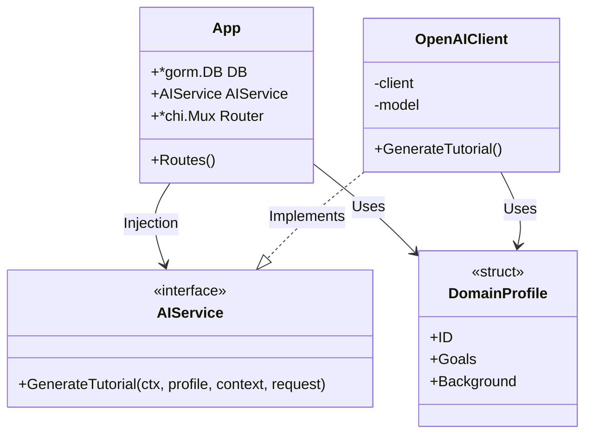
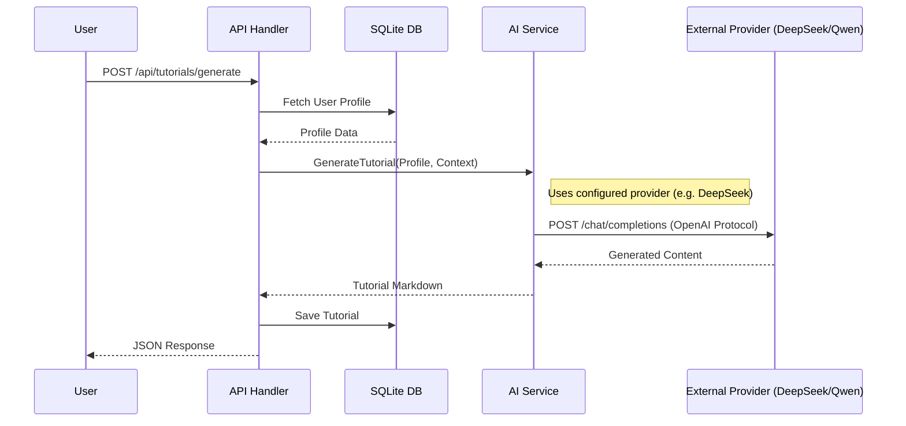

# AI Service Refactoring Walkthrough

I have successfully refactored the backend to support multiple AI providers using a clean architecture approach.

## Key Changes

### 1. New AI Service Interface
Created `backend/ai/service.go` which defines the contract for all AI providers.
```go
type AIService interface {
    GenerateTutorial(ctx context.Context, profile domain.Profile, codeContext string, userRequest string) (string, error)
}
```

### 2. Universal OpenAI-Compatible Provider
Implemented `backend/ai/openai_provider.go`. This client works with:
- **DeepSeek V3**
- **Qwen 3** (via DashScope/OpenRouter)
- **Official OpenAI**
- **Local LLMs** (Ollama, LM Studio)

It is configured via environment variables.

### 3. Domain Layer
Moved data models (Profile, Tutorial, Progress) to `backend/domain` to prevent circular dependencies.

### 4. Dependency Injection
Refactored `main.go` and `handlers.go` to inject the `AIService`.


## Architecture Overview

I have implemented a **Clean Architecture** style to decouple the core logic from external dependencies.

### Class Structure (Dependency Injection)

The `App` struct no longer depends on a concrete AI implementation. Instead, it depends on the `AIService` interface. This allows us to inject any provider (OpenAI, DeepSeek, Mock) at runtime.



### Request Flow (Sequence)

When a user requests a tutorial, the flow is as follows:



## Configuration

Update your `.env` file to use your preferred provider.

**For DeepSeek:**
```env
AI_API_KEY=sk-your-deepseek-key
AI_BASE_URL=https://api.deepseek.com
AI_MODEL=deepseek-chat
```

**For Qwen (via OpenRouter):**
```env
AI_API_KEY=sk-your-openrouter-key
AI_BASE_URL=https://openrouter.ai/api/v1
AI_MODEL=qwen/qwen-2.5-coder-32b-instruct
```
