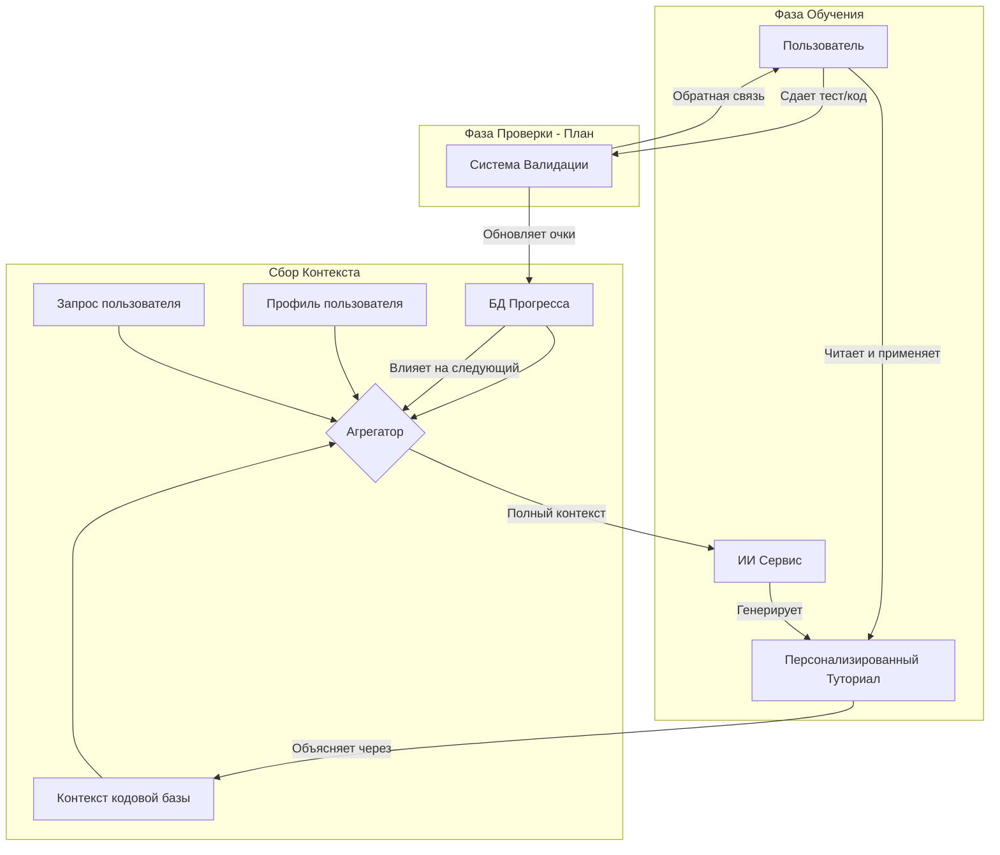

# Дизайн процесса адаптивного обучения

Этот документ описывает бизнес-логику "ИИ-Тьютора" и то, как система адаптируется под студента с течением времени.

## Основной цикл (Адаптивный круг)

Система работает по принципу непрерывной обратной связи. Она не просто "отвечает на вопросы", а выстраивает траекторию обучения.

## Пояснение данных

### 1. Статический контекст (Профиль)
*   **Что это:** "Кто я?" (например, "Знаю Python, учу Go").
*   **Где хранится:** Таблица `Profile`.
*   **Роль:** Задает *тон* и *метафоры*. (например, "В Go это похоже на декоратор в Python...").

### 2. Динамический контекст (Код)
*   **Что это:** Реальный код, который пользователь пишет прямо сейчас.
*   **Где хранится:** Читается динамически из файловой системы.
*   **Роль:** Обеспечивает *актуальность*. Урок использует *ваши* имена переменных и функций, а не абстрактные "foo/bar".

### 3. Исторический контекст (Прогресс)
*   **Что это:** Карта тем и оценки мастерства (0.0 - 1.0).
*   **Где хранится:** Таблица `Progress`.
*   **Роль:** Определяет *сложность*.
    *   *Низкий балл:* Объяснить основы, дать простые примеры.
    *   *Высокий балл:* Пропустить базы, показать крайние случаи (edge cases) и паттерны.

## Концепция: "Just-in-Time" обучение
В отличие от стандартных видеокурсов, где обучение линейно (Урок 1 -> Урок 2), эта система **графовая**.
1.  Пользователь сталкивается с проблемой в `main.go`.
2.  Система определяет недостающую концепцию (например, Dependency Injection).
3.  Система проверяет Прогресс: "С DI ранее не сталкивался".
4.  Система генерирует урок "Уровень 1" по DI, используя `main.go` пользователя как песочницу.
5.  Прогресс по теме "DI" обновляется до 0.3.
